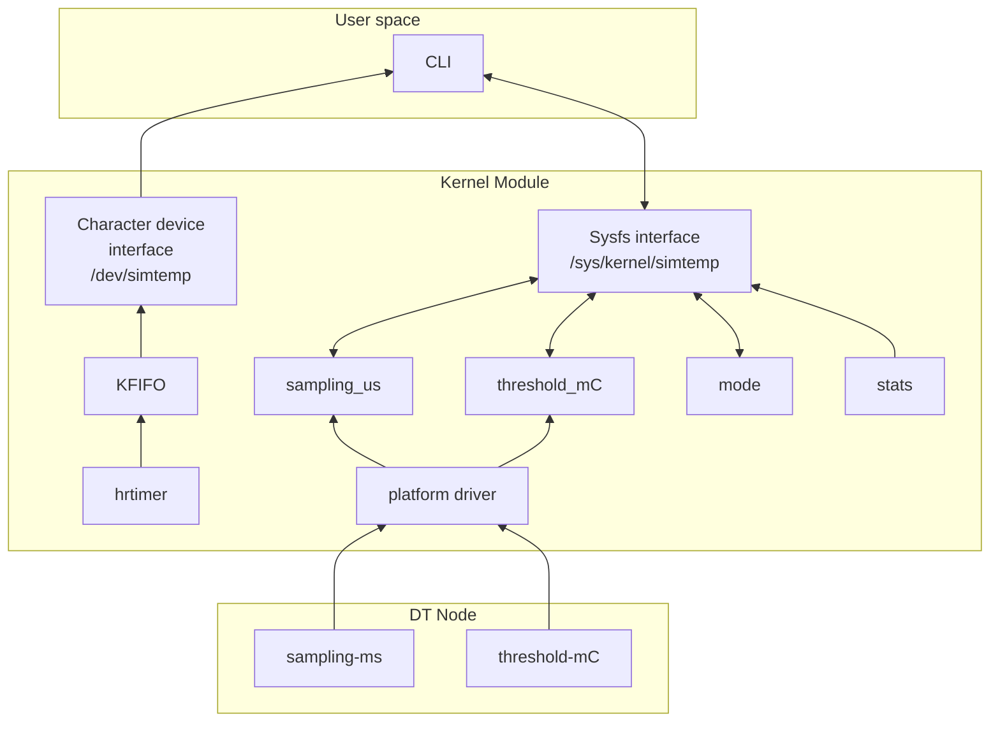

## Architecture

The `simtemp` kernel module simulates a temperature sensor device using a character device interface and a high-resolution timer (`hrtimer`). It is implemented as a platform driver that integrates with the device tree for configuration and exposes runtime parameters via sysfs.

### Major Components

1. **Platform Driver (`nxp_simtemp_driver`)**
   - Registers via `platform_driver_register()` and binds using `of_match_table`.
   - Parses device tree properties (`sampling-ms`, `threshold-mC`) in `probe()`.

2. **Character Device Interface**
   - A `/dev/simtemp` device node is created.
   - Supports `read()`, `poll()`, and `open()` system calls.
   - Allows userspace applications to retrieve simulated temperature samples.

3. **High-Resolution Timer (`hrtimer`)**
   - Periodically generates temperature samples based on the configured sampling rate.
   - The timer callback (`timer_callback()`) simulates temperature changes and pushes samples into a FIFO buffer.

4. **FIFO Buffer**
   - Stores recent temperature samples using a statically allocated `kfifo`.
   - Accessed by the timer (writer) and userspace readers (`read()`, `poll()`).

5. **Sysfs Interface**
   - Parameters like `sampling_us`, `threshold_mC`, and `mode` can be queried or configured via sysfs entries under `/sys/kernel/simtemp/`.
   - Also provides a `stats` file to report runtime counters and last error.

6. **Synchronization Mechanisms**
   - Spinlocks protect shared resources in time-critical or interrupt contexts (e.g., FIFO, flags).
   - Mutexes protect slower or user-initiated sysfs configuration operations.

7. **Wait Queues**
   - Implements blocking `read()` and `poll()` via `wait_event_interruptible()` when no new samples are available.

### Data Flow Overview

1. **Initialization:**
   - On load, the driver allocates a character device and initializes a high-resolution timer with the configured sampling period.
   - Device tree parameters are read during `probe()`.

2. **Sampling Loop:**
   - Timer callback is invoked at each sampling interval.
   - A new sample is generated, stored in the FIFO, and wakeups are issued to any blocked readers.

3. **Userspace Interaction:**
   - Users read temperature samples via the char device.
   - Configuration parameters can be read or modified through sysfs.
   - `poll()` can be used to wait for new data.

4. **Shutdown:**
   - On driver unload, the timer is cancelled, the FIFO is drained, and all device nodes and sysfs entries are cleaned up.

### Temperature Simulation Modes

- **Normal (`MODE_NRM`)**: Gaussian noise around a mean temperature.
- **Noisy (`MODE_NSY`)**: Larger standard deviation for more variability.
- **Ramp (`MODE_RMP`)**: Simulated rising temperature in a ramp.

### Block Diagram

>**NOTE**
> - In hrtimer are read sampling_us, threshold_mC and mode values; and stats values are updated, but these relationships where not pictured for simplicity of the diagram.


## API contract
### 1. Device Tree
- `sampling-ms`(int): Sampling period in ms. Range: 1 to 10,000 ms.
- `threshold-mC`(int): Alarm threshold in m° C. Range: -50,000 to 100,000 m°C.
>**Notes**
>If these properties are missing or are out-of-range, probe fails and they initialize with internal values.
### 2. Sysfs Interface (`/sys/kernel/simtemp`)
The exposed files are the following:
| File          | RW | Description                         | Format    | Constraints                             |
|---------------|----|-------------------------------------|-----------|-----------------------------------------|
| sampling_us   | RW | Sampling interval in µs             | int       | 50–10,000,000 µs. Error code: `E_EV_S_US`, `E_OR_S_US`                         |
| threshold_mC  | RW | Threshold for alert                 | int       | -50,000 to 100,000 m°C. Error codes: `E_EV_TH`. `E_OR_TH`                       |
| mode          | RW | Temperature generation mode         | char '0','1','2' | 0: normal, 1: noisy, 2: ramp. Erro code `E_EV_MD`       |
| stats         | R  | System stats and last error string  | formatted string | Shows counter, alerts, last error |

> **Notes**
> - Reading values is safe anytime. Even though, at high sampling rate (sampling_us < 1ms ,(1kHz), it's recomended to avoid printing in terminal the sample values, but log them in a file) 
> - Writting triggers validation. If invalid, driver sets `e_flags.l_error` to a constant that describes the error.
### Modes
| Mode | Description
|--------|----------
|0| Gaussian noise (20° C mean and 0.1 °C std)
|1| Gaussian noise (20° C mean and 2 °C std)
|2| Ramp pattern looping from -50°C to 100°C

### Error flags (`e_flags.l_error`) :

| Code						| Value		| Description
|---------------------|----------|--------------
| E_NO_ERR			| 10			| No error.
| E_EV_S_US			| 11			| Invalid sampling_us.
| E_OR_S_US			| 12			| sampling_us out of range.
| E_EV_TH				| 13			| Invalid threshold_mC.
| E_EV_MD				| 14			| Invalid mode.
| E_MN_ALLOC		| 15			| Major number alloc failled
| E_DV_ADD			| 16			| Add device failed.
| E_CL_CREATE		| 17 | Create class failed.
| E_DV_CREATE	| 18			| Create device failed.
| E_KO_CREATE	| 19			| Create kobject failed.
| E_SYS_CREATE	| 20			| Create sysfs group failed.
| E_OR_TH				| 21			| threshold_mC out of range.

- These error flags description appears in `/sys/kernel/simtemp/stats`.

### 3. Character Device Interface (`/dev/simtemp`)
- **open()**
	- Logs file opening.
- **read()**:
  - Returns `struct simtemp_sample` (packed).
  - Blocking until data is available (use `poll()`).
- **write()**:
  - Not supported.
- **poll()**:
  - Signals when new data is ready (new sample pushed).
- **release()**
	- Logs file closing.

### 4. Sample Data Format
```c
struct simtemp_sample {
    __u64 timestamp_ns;
    __s32 temp_mC;
    __u32 flags; // Bitmask of FLAG_NEW_SAMPLE, FLAG_THRESHOLD_CROSSED
};
````
- **Event flags** are bit masks:
	- `FLAG_NEW_SAMPLE` (1<<0)
	- `FLAG_THRESHOLD_CROSSED` (1 << 1)
- A FIFO (`kfifo`) stores samples. Old values may be overwritten if buffer is full.

## Threading and Locking Model

This driver uses a high-resolution timer (`hrtimer`) to simulate periodic temperature sampling. The timer callback (`timer_callback()`) runs in **softirq context**, not process context, and thus requires careful synchronization for shared data access.

### 1. Timer and Concurrency Model

- A high-resolution timer (`my_timer`) is initialized and started during driver init (`nxp_simtemp_init()`).
- The `timer_callback()` is executed periodically, generating a new simulated temperature sample.
- The callback:
  - Computes a new temperature value based on the selected mode.
  - Updates shared state: `current_sample`, `CBuffer`, and `e_flags`.
  - Wakes up any reader blocked on the wait queue (`wq`) via `wake_up_interruptible()`.

### 2. Access Contexts

| Shared Variable       | Accessed From             | Access Type       | Protection            |
|-----------------------|---------------------------|-------------------|------------------------|
| `sampling_us`         | show, store, timer init   | read/write        | `sampling_us_lock` (mutex), atomic read (`READ_ONCE`) |
| `threshold_mC`        | show, store, timer        | read/write        | `threshold_mC_lock` (mutex), atomic read (`READ_ONCE`) |
| `mode`                | show, store, timer        | read/write        | `mode_lock` (mutex), atomic read (`READ_ONCE`)         |
| `TEMP_STD_mC`         | timer, mode_store               | write-only        | Protected indirectly through `mode_lock`, atomic read (`READ_ONCE`) in timer              |
| `current_sample`      | timer, `read()` | read/write        | `fifo_lock` (spinlock)                                  |
| `CBuffer`             | timer, `read()`, `poll()` | read/write        | `fifo_lock` (spinlock)                                  |
| `e_flags`             | timer, sysfs, error paths | read/write        | `flags_lock` (spinlock)                                 |

### 3. Summary of Threading Contexts

- **Process Context**:
  - `sysfs` accesses (`*_store`, `*_show`)
  - `read()`, `poll()`
- **Interrupt/Softirq Context**:
  - `timer_callback()` runs in softirq context (as per `hrtimer`)
- **Synchronization**:
  - **Mutexes** protect long operations and shared settings *that are updated in a process context* (`sampling_us`, `threshold_mC`, `mode`). These shared settings are read in **Interrupt context**, so their value was obtained with `READ_ONCE`.
  - **Spinlocks** are used in fast paths (e.g., within the timer or FIFO operations) *where no sleep is allowed for writing/updating values* (`CBuffer`,`current_sample`,`e_flags`)

### 4. Wait Queues

- A `wait_queue_head_t` (`wq`) is used to block `read()` or `poll()` calls until new data is available.
- `wake_up_interruptible(&wq)` is triggered from the timer after pushing a new sample.


## DT mapping

This driver can be configured through Device Tree, using a compatible node. The DT properties allow loading default values at probe time, without requiring runtime sysfs configuration.

### 1. Compatible string
	`compatible = "nxp,simtemp"`
This must be present for the platform driver to bind.
### 2. Expected DT properties
| Name | Type | Units | Description | Constraints
|-|-|-|-|---
|`sampling-ms`| `u32`|ms|Sampling period for temperature readings | 1 to 10,000 ms
|`threshold-mC`| `s32`|m°C|Temperature threshold for alerts. | -50,000 to 100,000 m°C
> **Note**
> These DT properties override the defaults:
> - `sampling_us = 150000` (150 ms)
> - `threshold_mC = 20000` (20° C)

### 3. DT node applied

    &soc {
        simtemp0: simtemp@0 {
            compatible = "nxp,simtemp";
            sampling-ms = <100>;
            threshold-mC = <45000>;
            status = "okay";
        };
    };
